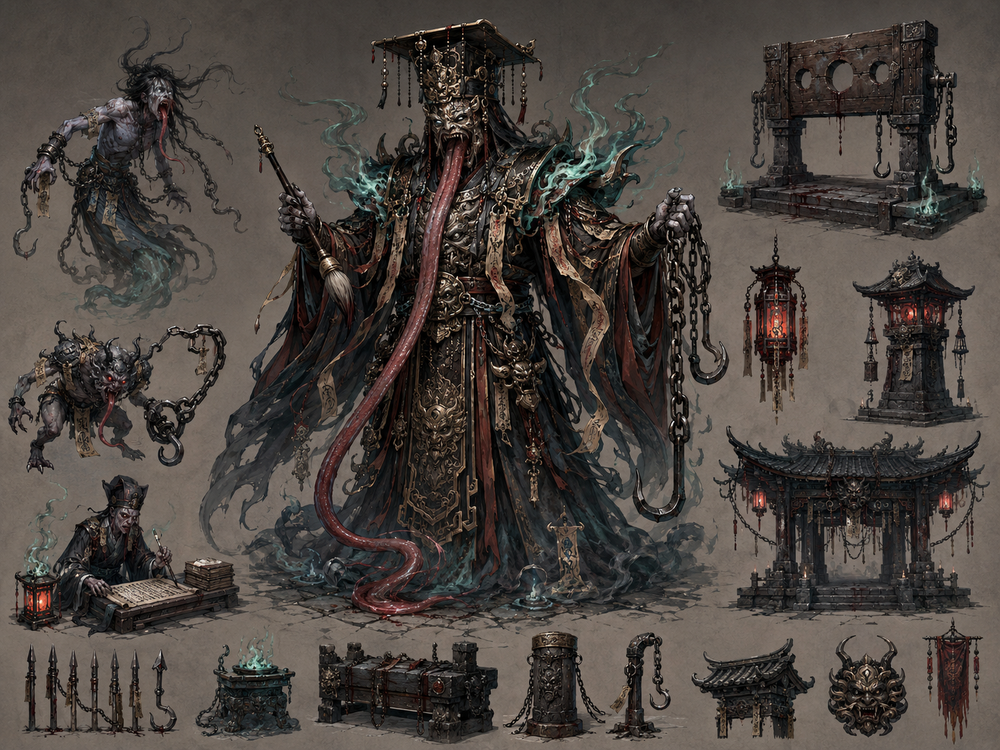
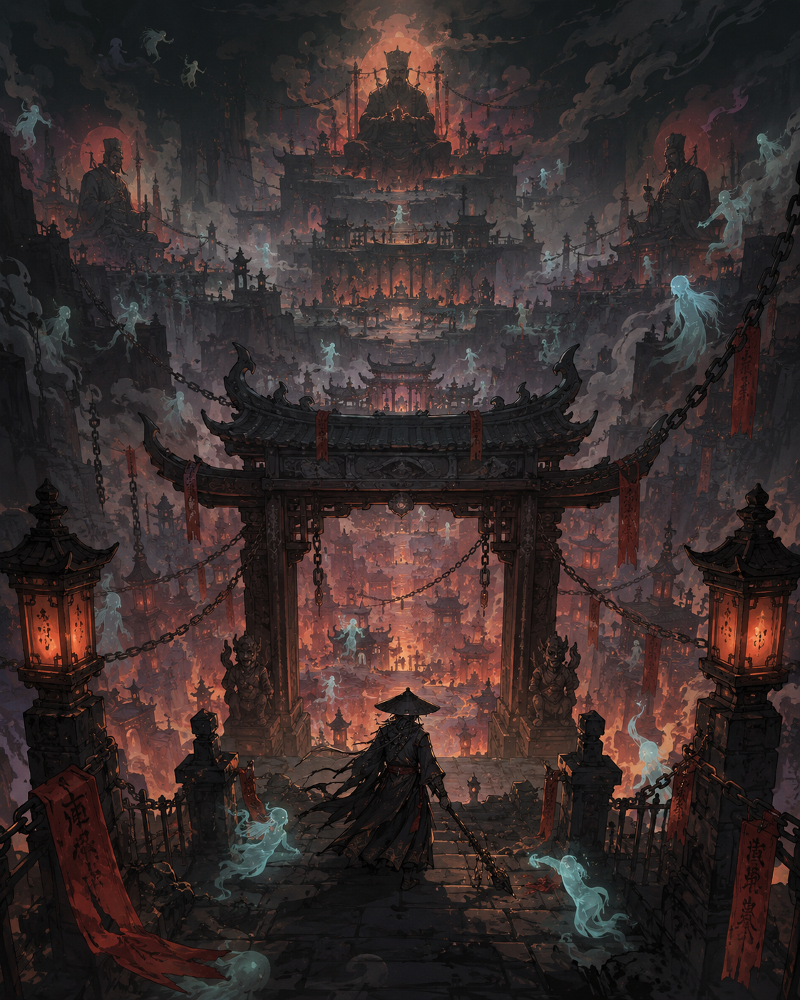
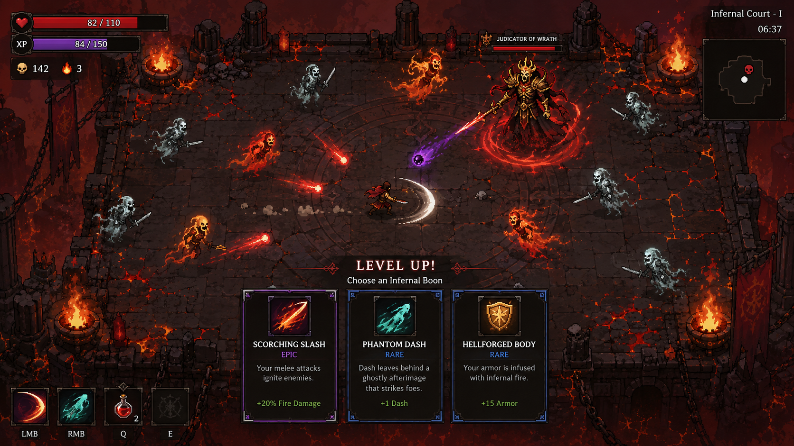

# 地府：十八重界

**Diyu: Eighteen Realms**

中文说明 | [English](README.md)

`地府：十八重界` 是一款以中式民俗、佛道地府与“十八层地狱”为背景的高速 2D 动作肉鸽游戏。游戏核心体验围绕俯视角即时战斗、不断升级的敌潮压力，以及类似《英雄联盟》海克斯强化 / 斗魂竞技场符文选择机制的随机天赋构筑展开。

玩家将在十八重地府界域中逐层深入，面对怨魂、鬼差、狱卒、刑罚机关与神话化的地狱灾厄，并通过每局随机出现的强化选择，构筑不同的战斗流派。

## 核心概念

- **游戏类型：** 2D 动作肉鸽 / 竞技场生存
- **题材背景：** 中式民俗、地府、十八层地狱
- **战斗手感：** 快节奏、响应迅速、支持 8 方向平滑移动的俯视角动作战斗
- **成长机制：** 类似海克斯强化 / 斗魂竞技场符文选择的随机天赋系统
- **目标体验：** 每一局都能形成不同的武技、法术、诅咒或混合流派构筑

## 概念图

早期地府界域与视觉方向概念图存放在 `art/concepts/realms/`。

### 地狱守卫



### 地狱之门



### 炼狱战场



## 技术栈

- **引擎：** Godot Engine 4.6.2
- **脚本语言：** GDScript
- **渲染模式：** Compatibility Mode
- **2D 风格：** 面向像素美术的渲染设置
- **纹理过滤：** Nearest
- **拉伸模式：** Viewport
- **宽高比处理：** Keep
- **开发环境：** Windows 11，Cursor / Antigravity IDE

## 当前进度

项目目前处于基础搭建阶段。

已完成内容：

- 创建 Godot 项目基础结构。
- 配置 2D 像素风渲染设置。
- 创建 `Player` 场景，根节点使用 `CharacterBody2D`。
- 添加 `Sprite2D` 作为玩家视觉节点。
- 添加 `CollisionShape2D` 用于基础碰撞。
- 配置移动输入映射：
  - `move_left`
  - `move_right`
  - `move_up`
  - `move_down`
- 在 `player.gd` 中实现 8 方向俯视角平滑移动，使用：
  - `Input.get_vector()`
  - `move_and_slide()`

## 当前项目结构

```text
res://
├── project.godot
├── README.md
├── README_ZH.md
├── icon.svg
├── icon.svg.import
├── player.tscn
├── player.gd
└── player.gd.uid
```

当前项目结构保持精简。随着开发推进，建议逐步整理为更适合生产开发的目录结构：

```text
res://
├── scenes/
│   ├── player/
│   │   └── player.tscn
│   ├── enemies/
│   ├── levels/
│   ├── ui/
│   └── effects/
├── scripts/
│   ├── player/
│   ├── combat/
│   ├── enemies/
│   ├── augments/
│   └── systems/
├── assets/
│   ├── sprites/
│   ├── audio/
│   ├── fonts/
│   └── vfx/
├── resources/
│   ├── augments/
│   ├── enemies/
│   └── realms/
└── project.godot
```

## 开发路线图

### 第一阶段：核心战斗与打击停顿

- 增加玩家攻击行为。
- 实现近战或远程攻击判定。
- 增加敌人的受击区域与生命值组件。
- 搭建伤害、击退、无敌帧与死亡处理。
- 加入打击停顿、屏幕震动和命中特效，强化战斗反馈。

### 第二阶段：动态刷怪与升级强化 UI

- 实现基于波次或导演系统的敌人生成。
- 增加经验拾取与升级流程。
- 制作随机强化选择界面。
- 设计强化品质、标签与流派协同规则。
- 支持类似斗魂竞技场符文选择的构筑强化体验。

### 第三阶段：十八层地狱生态生成

- 制作第一个可游玩的地府界域原型。
- 定义每一层地狱的生态规则。
- 加入界域专属机关、敌人族群与视觉风格。
- 探索程序化或半程序化竞技场布局。
- 逐步扩展到十八个具有差异化战斗体验的地府界域。

## 开发说明

本项目当前重点是建立稳定、清晰、响应迅速的战斗基础。在核心手感确认后，再逐步扩展敌人族群、随机强化、地府界域生成与长期内容生产管线。

## 许可证

项目许可证尚未确定。
